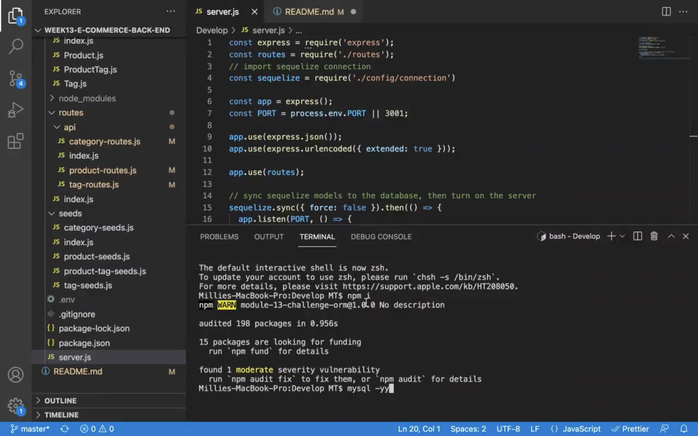
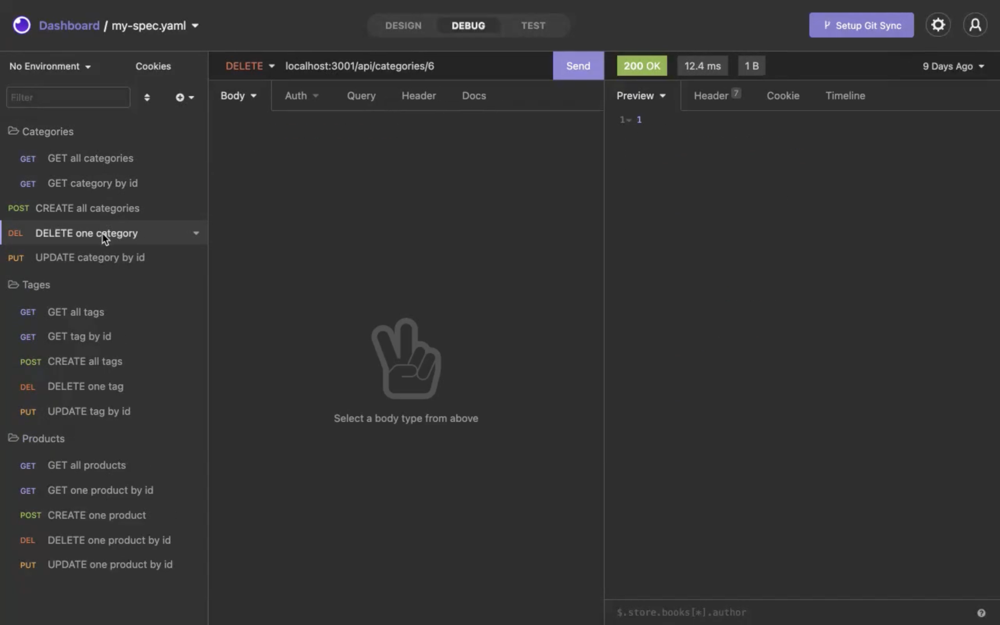

# 13 Object-Relational Mapping (ORM): E-Commerce Back End

## Description

Internet retail, also known as **e-commerce**, is the largest sector of the electronics industry, generating an estimated $29 trillion in 2019. E-commerce platforms like Shopify and WooCommerce provide a suite of services to businesses of all sizes. Due to their prevalence, understanding the fundamental architecture of these platforms will benefit you as a full-stack web developer.

Built the back end for an e-commerce site by modifying starter code. Configured a working Express.js API to use Sequelize to interact with a MySQL database.

## User Story

```md
AS A manager at an internet retail company
I WANT a back end for my e-commerce website that uses the latest technologies
SO THAT my company can compete with other e-commerce companies
```

## Acceptance Criteria

```md
GIVEN a functional Express.js API
WHEN I add my database name, MySQL username, and MySQL password to an environment variable file
THEN I am able to connect to a database using Sequelize
WHEN I enter schema and seed commands
THEN a development database is created and is seeded with test data
WHEN I enter the command to invoke the application
THEN my server is started and the Sequelize models are synced to the MySQL database
WHEN I open API GET routes in Insomnia Core for categories, products, or tags
THEN the data for each of these routes is displayed in a formatted JSON
WHEN I test API POST, PUT, and DELETE routes in Insomnia Core
THEN I am able to successfully create, update, and delete data in my database
```

### Database Models

This database contain the following four models, including the requirements listed for each model:

- `Category`

  - `id`

    - Integer.

    - Doesn't allow null values.

    - Set as primary key.

    - Uses auto increment.

  - `category_name`

    - String.

    - Doesn't allow null values.

- `Product`

  - `id`

    - Integer.

    - Doesn't allow null values.

    - Set as primary key.

    - Uses auto increment.

  - `product_name`

    - String.

    - Doesn't allow null values.

  - `price`

    - Decimal.

    - Doesn't allow null values.

    - Validates that the value is a decimal.

  - `stock`

    - Integer.

    - Doesn't allow null values.

    - Set a default value of `10`.

    - Validates that the value is numeric.

  - `category_id`

    - Integer.

    - References the `Category` model's `id`.

- `Tag`

  - `id`

    - Integer.

    - Doesn't allow null values.

    - Set as primary key.

    - Uses auto increment.

  - `tag_name`

    - String.

- `ProductTag`

  - `id`

    - Integer.

    - Doesn't allow null values.

    - Set as primary key.

    - Uses auto increment.

  - `product_id`

    - Integer.

    - References the `Product` model's `id`.

  - `tag_id`

    - Integer.

    - References the `Tag` model's `id`.

### Associations

Executed association methods on Sequelize models to create the following relationships between them:

- `Product` belongs to `Category`, and `Category` has many `Product` models, as a category can have multiple products but a product can only belong to one category.

- `Product` belongs to many `Tag` models, and `Tag` belongs to many `Product` models. Allow products to have multiple tags and tags to have many products by using the `ProductTag` through model.

**Hint:** Make sure you set up foreign key relationships that match the column we created in the respective models.

### Fill Out the API Routes to Perform RESTful CRUD Operations

Fill out the unfinished routes in `product-routes.js`, `tag-routes.js`, and `category-routes.js` to perform create, read, update, and delete operations using your Sequelize models.

Note that the functionality for creating the many-to-many relationship for products has already been completed for you.

> **Hint**: Be sure to look at the mini-project code for syntax help and use your model's column definitions to figure out what `req.body` will be for POST and PUT routes!

### Seed the Database

After creating the models and routes, run `npm run seed` to seed data to your database so that you can test your routes.

### Sync Sequelize to the Database on Server Start

Create the code needed in `server.js` to sync the Sequelize models to the MySQL database on server start.

## License

[](https://opensource.org/licenses/MIT)

### Walkthrough Video

- Terminal part (Please click screenshot to watch the video)
  [](https://drive.google.com/file/d/1l2sptcM7aotVsKQ-xYoS0bWmg_goP1_-/view?usp=sharing)

- Demo in Insomnia (Please click screenshot to watch the video)
  [](https://drive.google.com/file/d/1Bi4rgNtEXqg-T2m3OFEigkYH0DO2S4IE/view?usp=sharing)

### Technology used

- Connects to a MySQL database using the [MySQL2](https://www.npmjs.com/package/mysql) and [Sequelize](https://www.npmjs.com/package/sequelize) packages.

- Stores sensitive data, like a user’s MySQL username, password, and database name, using environment variables through the [dotenv](https://www.npmjs.com/package/dotenv) package.

- Syncs Sequelize models to a MySQL database on the server start.

- Includes column definitions for all four models outlined in the homework instructions.

- Includes model associations outlined in the homework instructions.

- Express.js API

---

© 2021 Trilogy Education Services, LLC, a 2U, Inc. brand. Confidential and Proprietary. All Rights Reserved.
